# 퀀투봇 포트폴리오

## 1. 프로젝트 개요
퀀투봇은 퀀트 투자에 대한 높은 진입장벽을 낮추기 위해 시작된 프로젝트입니다.  
일반적으로 퀀트 투자는 복잡한 전략 수립, 백테스트 코드 작성, 수치 해석 등 많은 전문 지식과 시간이 요구되며, 시중에 나와 있는 퀀트 투자 서적이나 도구들도 대부분 사용자가 직접 전략을 구현하는 형태로 구성되어 있습니다.

퀀투봇은 이러한 복잡함을 걷어내고,  
**전략을 직접 계산하거나 분석하지 않아도, 클릭 한 번으로 전략 결과를 바로 알 수 있도록** 했습니다.  
누구나 쉽게 전략 기반 투자를 시각적으로 이해하고 시작할 수 있도록 돕는 것이 핵심 목표입니다.

## 2. 주요 기능 소개
퀀투봇은 사용자 친화적인 구조로 다양한 퀀트 투자 전략을 제공합니다.  
핵심 기능은 다음과 같습니다:

- **주식 정보 제공**  
  주요 지표(PER, EV/EBITDA 등)를 중심으로 미국 주식에 대한 요약 정보를 제공합니다.

- **전략 기반 퀀트 투자 추천**  
  사용자는 두 가지 성향 중 선택할 수 있습니다:
  - 방어형 전략: 리스크를 최소화한 보수적 투자 전략  
  - 공격형 전략: 상승 모멘텀을 중심으로 한 고수익 추구 전략

- **나만의 퀀트 투자 리스트 관리**  
  선택한 전략과 종목들을 포트폴리오로 저장하고,  
  매수/매도 조건 만족 시 **실시간 푸시 알림**을 받을 수 있습니다.

## 3. 아키텍처 다이어그램
퀀투봇은 웹 기반 퀀트 투자 시스템으로, 프론트엔드와 백엔드를 분리한 구조로 구성되어 있습니다.

### 📌 시스템 구성
- **프론트엔드**: Flutter Web (RESTful API 통신)  
- **백엔드**: Flask API / PostgreSQL / Flask-Caching  
- **인프라**: S3 + CloudFront + Route53 (FE), Lightsail + Docker (BE)

### 🔐 보안 및 HTTPS 처리
- CloudFront HTTPS 인증서를 통해 모든 통신 암호화  
- Nginx는 리버스 프록시 역할 수행

### 📷 아키텍처 구성도
<!-- TODO: 이미지 삽입 예정 -->


## 4. 기술 스택
퀀투봇은 빠른 개발과 유지보수가 가능한 경량 기술 스택을 기반으로 구축되었습니다.

### ✅ 사용 기술 목록

| 구성 요소       | 기술 스택                              |
|----------------|----------------------------------------|
| 프론트엔드     | Flutter Web                             |
| 백엔드         | Flask (Python),                          |
| 데이터베이스   | PostgreSQL                              |
| 캐시           | Flask-Caching                           |
| 인프라         | AWS S3, CloudFront, Route53, Lightsail |
| 형상관리 및 CI | Git, GitHub Actions, Docker, Docker-compose                     |

### 🔍 기술 선택 이유
- **Flutter Web**: 크로스 플랫폼 대응 / 1인 개발에 최적
- **Flask**: 경량, 유연한 REST API 구현 / 빠른 확장
- **PostgreSQL**: 안정성 + NoSQL 유연성
- **GitHub Actions**: 빌드/배포 자동화 통한 일관성 유지

## 5. 문제 해결 사례

### 🧩 1) Flutter Web의 Service Worker 비호환 문제

**문제 상황**  
Flutter 웹앱에 푸시 알림을 구현하려 했으나, 웹용으로 자동 생성되는 `flutter_service_worker.js` 파일이 알림 이벤트를 정상적으로 처리하지 못하는 문제가 발생했습니다. 최신 Flutter SDK조차도 직접적인 푸시 이벤트 등록을 지원하지 않아, 서비스 워커에 알림 이벤트를 수동 삽입해야 했습니다.

**해결 과정**  
- Flutter build 후 생성되는 `flutter_service_worker.js` 내부에 알림 핸들러 코드 삽입이 필요했으나, 빌드 시마다 파일이 재생성되므로 수작업이 무의미했음  
- 이를 해결하기 위해 `.sh` 스크립트를 작성하여 빌드 후 자동으로 필요한 코드 블럭을 삽입하도록 처리

```bash
# build.sh 내부 일부
CUSTOM_CODE=$(cat <<EOF
self.addEventListener('push', function(event) {
  const data = event.data.json();
  ...
});
EOF
)

echo "$CUSTOM_CODE" >> build/web/flutter_service_worker.js
```

**결과**  
Flutter 웹앱에서 알림 이벤트가 정상적으로 동작했고, 웹 푸시 알림도 모바일 앱 수준으로 작동하게 됨. 공식적인 해결 가이드가 거의 없어 독자적으로 시행착오 끝에 구축한 부분으로, 웹 앱 개발 시 푸시 알림 구현의 난이도를 체감한 경험이었음.

---

### ☁️ 2) 비용 최적화 + AWS 클라우드 인프라 설계 전환

**문제 상황**  
프로젝트 초기에는 윈도우 데스크탑에서 Flask 서버를 수동으로 띄우고 운영했는데,  
- 도커 구성 불가  
- 푸시 인증서 문제  
- 네트워크 포트 포워딩과 외부 노출의 불안정성  
등의 문제로 운영이 비효율적이었고, 개발 환경과 운영 환경의 분리도 되지 않았습니다.

**해결 과정**  
- AWS Lightsail을 활용해 저렴하면서도 고정 IP, 방화벽, 모니터링이 가능한 서버 인프라 구성  
- Docker 기반으로 백엔드, PostgreSQL, Nginx를 컨테이너화하여 CI/CD 구조 확립  
- 프론트엔드는 S3 + CloudFront로 정적 배포하고, HTTPS는 CloudFront에 ACM 인증서를 붙여 통합 처리

**결과**  
월 $5~10 수준의 인프라 비용으로도 충분히 운영 가능한 구조를 갖추게 되었고,  
현실적인 클라우드 인프라 설계와 비용 최적화 경험을 체득함.  
직접 운영하던 데스크탑 서버의 비효율을 극복하고, 실서비스로 확장 가능한 기반을 마련.

---

### 🔔 3) 푸시 알림 누락 문제 (트랜잭션 처리 타이밍 이슈)

**문제 상황**  
일부 사용자에게 푸시 알림이 전송되지 않거나, 상태 변경과 알림 수신 사이에 타이밍 오류가 발생하는 현상이 있었습니다.

**원인 분석**  
푸시 알림 로직이 DB 상태 변경과 동일한 트랜잭션 내부에 포함되어 있었고, 트랜잭션이 롤백되거나 실패할 경우에도 알림이 외부로 나가 정합성이 깨질 수 있었음.

**해결 과정**  
- Flask 내에서 트랜잭션 블록을 명확히 분리 (`with transaction_scope():`)  
- 투자 상태 변경과 DB 커밋이 완료된 후에만 푸시 알림을 발송하도록 알림 트리거 위치 재조정  
- 비동기 큐 시스템 없이도 안정적인 처리 흐름을 구현

**결과**  
알림 누락이 사라졌고, 상태 변경과 알림 발송 사이의 정합성을 보장하는 구조를 확보.  
실시간 이벤트 기반 구조의 설계 감각을 키울 수 있었던 결정적인 계기.


## 6. 데이터 흐름 & 전략 설명

### 📈 추세 추종 전략 (Trend-Following)
- 매일 10:30 yfinance 데이터 기반 75일 평균선과 종가 비교  
- 추세 변화 시 사용자에게 푸시 알림

### 🌍 듀얼 모멘텀 국제 ETF 전략
- 매일 리밸런싱 / 최근 1개월간 수익률 기준 ETF 1종 선택  
- 절대 + 상대 모멘텀 모두 만족해야 선택됨

### 🔁 데이터 흐름 요약
```
[yfinance API] → [전략 계산 로직] → [상태 판단] → [푸시 알림 전송]
```

## 7. 개인 기여도

이 프로젝트는 **기획부터 배포까지 1인 개발자로 전부 수행**했습니다.

- 전략 설계 / Flask API / Flutter UI / PostgreSQL 설계 / 푸시 시스템
- AWS 인프라 구성 / Docker 설정 / CI 자동화 등 전체 운영 주도

**기술적 도전**  
- 웹 푸시 알림 구조 이해 및 구현 (Service Worker 활용)  
- 집 데스크탑에서 서버 운영 후 AWS Lightsail로 이전하며 최소 비용 인프라 구성

## 8. 스크린샷 / 시연 링크

### 📸 주요 화면 예시
- 메인 화면  
  <!-- TODO: ./images/main_screen.png -->
- 전략 선택 화면  
  <!-- TODO: ./images/strategy_select.png -->
- 푸시 알림 화면  
  <!-- TODO: ./images/push_notification.png -->

### 🌐 시연 링크
- https://quantwo-bot.com <!-- TODO -->

## 9. 느낀점 및 향후 개선

### ✨ 느낀 점
기획부터 개발, 인프라 구성, 배포까지 모든 과정을 직접 수행하며  
**서비스 개발의 전체 흐름을 실전처럼 경험**할 수 있었습니다.

### 🔧 향후 개선 계획
- 전략 수익률 시각화 및 포트폴리오 그래프 추가
- UI 반응 속도 개선 및 인터랙션 향상
- 시스템 로깅 체계화 및 에러 모니터링 도입
